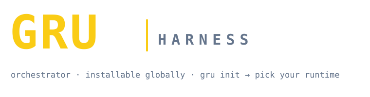

<div align="center">



</div>

> **"Gru coordinates. Minions produce. Policies govern. Human approves."**

<div align="center">

   

</div>

---

<div align="center">

🇪🇸 [**Español**](../../README.md) &nbsp;|&nbsp; 🇺🇸 [**English**](README.en.md) &nbsp;|&nbsp; 🇨🇳 [**中文**](README.zh.md) &nbsp;|&nbsp; 🇫🇷 [**Français**](README.fr.md) &nbsp;|&nbsp; 🇩🇪 [**Deutsch**](README.de.md)

</div>

---

## 🧠 Was ist Gru Harness?

Gru ist ein **LLM-Orchestrator-Harness**: eine Koordinationsschicht, die die Entscheidungsfindung zentralisiert, das Risiko jeder Aufgabe bewertet und die Ausführung an spezialisierte Provider delegiert (Ruflo, Gentle-Pi, ECC, Engram, Awesome Copilot…). Er läuft innerhalb von Claude Code, Codex, Gemini CLI, OpenCode, Cursor oder Antigravity — oder eigenständig über die `gru`-CLI.

### Grundprinzipien

* **Gru programmiert nicht direkt**: Es analysiert, klassifiziert und delegiert. Die Minions erzeugen die Artefakte.
* **Strikte Laufzeit**: Gru **simuliert niemals Antworten**. Ist ein Provider nicht installiert, blockiert es die Aufgabe und sagt dir, wie du ihn installierst.
* **Menschliches Freigabe-Gate**: Jede destruktive, Produktions-, Sicherheits-, Hauptzweig- oder kostenverursachende Aufgabe erfordert deine ausdrückliche Freigabe. Das Gate ist zweisprachig (ES/EN) und nicht per Prompt verhandelbar.
* **Stufenbasierte Workflows**: Aufgaben werden von Stufe 0 (trivial) bis Stufe 4 (kritisch) über eine Entscheidungstabelle aus Komplexität + Risiko klassifiziert.

---

## 🧩 Minions vs. Provider

Zwei verschiedene Konzepte, **nicht** austauschbar:

* **Minion** — eine delegierte *Rolle* (builder, reviewer, architect, tester, security, devil, pm, docs, filesystem, context7, memory, mcp). Es ist die **Arbeitseinheit**, die Gru delegiert. 13 Rollen, jede mit einer einzigen Verantwortung.
* **Provider** — ein Ausführungs-*Backend* (`local`, `ruflo`, `gentlePi`, `gentlemanCli`, `ecc`, `deepagents`, `engram`, `awesomeCopilot`). Es ist die **Laufzeit**, die die Arbeit des Minions ausführt.

> Ein Minion ist eine ROLLE. Ein Provider ist ein BACKEND. Gru wählt beide je nach Stufe und Aufgabentyp.

---

## 📊 Aufgabenstufen

Gru bewertet jede Aufgabe (Komplexität + Risiko) und klassifiziert sie vor dem Handeln:

| Stufe | Name | Workflow (Zusammenfassung) |
|:---:|---|---|
| **0** | Trivial | `local` |
| **1** | Klein | `local` + devil/caveman |
| **2** | Mittel | leichter architect → mini-spec → builder → tester → reviewer |
| **3** | Groß | architect → devil → spec → builder pro Einheit → tester → security → reviewer |
| **4** | Kritisch | + Ruflo CONSULT + **menschliche Freigabe** + unabhängiger reviewer |

Der **Filesystem Scan** ist vor jeder Klassifizierung verpflichtend. Repo-Belege können die Stufe anheben, niemals ohne Beleg senken.

---

## 🚀 Schnellstart

```bash
pnpm add -g github:AdrichDev/gru_orchestrator   # installiert `gru` (privates Repo, Node 20+)
cd dein-projekt
gru init                    # interaktives Menü: Runtime(s) + Scope wählen
gru status                  # realer Status jedes Providers
gru "<prompt>"              # eine Aufgabe orchestrieren: klassifizieren → routen → ausführen
```

Das `postinstall` bereitet `~/.gru/` mit der Standardkonfiguration vor. Der
awesome-copilot-Katalog ist **opt-in** (`gru init --awesome-copilot`); er wird nicht
automatisch heruntergeladen.

---

## ⌨️ Befehle

```bash
gru "<prompt>"                       # orchestrieren: klassifizieren → Gate → routen → ausführen
gru status                           # realer Provider-Status (Aliase: doctor, /status)
gru status --strict                  # CI: Exit-Code 2, wenn ein benötigter Provider fehlt
gru --agentic "<prompt>"             # agentische Pipeline: executor → reviewer → tester + Gates
gru --agentic "<prompt>" --phase apply --sdd mein-change
gru init [optionen]                  # Multi-Runtime-Scaffolding
```

Jeder Lauf wird in `runs/run_*.json` protokolliert (Klassifizierung, Stufe, Provider,
Exit-Code und ob eine menschliche Freigabe vorlag). In CI / Nicht-TTY wird eine riskante
Aufgabe **nicht ausgeführt**: Sie endet mit Exit-Code 2 — sie simuliert nie.

---

## 🔌 Provider

Gru delegiert an spezialisierte Provider: `local`, `ruflo`, `gentlePi`, `gentlemanCli`,
`ecc`, `deepagents`, `engram` und `awesomeCopilot` (Nur-Such-Katalog). Unter der strikten
Laufzeit blockiert ein fehlender Provider die Aufgabe mit seinem Installationshinweis —
kein stilles Fallback.

---

## 🛡️ Cybersecurity-Harness (Blue / Red / Purple)

Bei jeder Anfrage zum Auditieren, Ausnutzen, Härten oder Threat-Modeling delegiert Gru an
Cybersecurity-Minions. Offensive Arbeit ist **immer** durch `cybersec-minion-contract.md`
begrenzt (nur autorisierter Umfang, Lab/Sandbox, keine echten Ziele).

| Team | Minions |
|---|---|
| 🔴 **RED** | redteam-coordinator · recon · exploit |
| 🔵 **BLUE** | blueteam-coordinator · hardening · detect · incident |
| 🟣 **PURPLE** | purpleteam-coordinator (treibt die Schleife + persistiert Erkenntnisse) |

**Zyklische Schleife:** `RECON → EXPLOIT → ASSESS → HARDEN → DETECT → REAUDIT → LEARN → wiederholen`.
Ein Durchbruch des Red ist ein OPEN-Befund; das Blue muss ihn beheben **und** eine Erkennung hinzufügen, um ihn zu schließen.
`HARDENED` wird nie deklariert, solange ein OPEN-Befund besteht.
→ [docs/cybersec/ATTACK-DEFENSE-PLAYBOOK.md](../cybersec/ATTACK-DEFENSE-PLAYBOOK.md)

---

## 😈 Devil's Advocate

Eine Veto-Persona, die jede Entscheidung hinterfragt. Die Strenge ist in
`.gru/config.yaml` (`devil.rigidity`) konfigurierbar:

| Stufe | Verhalten |
|---|---|
| `advisory` | warnt, blockiert nicht |
| `strict` *(Standard)* | blockiert riskante Aufgaben ohne Begründung |
| `paranoid` | verlangt ausdrückliche Freigabe auch bei mittleren Aufgaben |

Die **harten Regeln** (destruktiv, Produktion, Sicherheit, Kosten) sind unabhängig von der
Strenge-Stufe immer aktiv. → Details in [USAGE.md](../../USAGE.md#devils-advocate--niveles-de-rigidez).

---

## 📖 Dokumentation

* **[USAGE.md](../../USAGE.md)** — vollständige Referenz: Befehle, `gru init`, Provider, Umgebungsvariablen und Fehlerbehebung.
* **[STRICT_PROVIDER_RUNTIME.md](../../STRICT_PROVIDER_RUNTIME.md)** — die strikte Provider-Laufzeit.
* **[SDD.md](../../SDD.md)** — Spec-Driven Development: Phasen, Persistenz und Engram-Format.
* **[docs/harness-reference.md](../harness-reference.md)** — Provider-Katalog, Personas, Workflows und Project Intake.
* **[docs/cybersec/ATTACK-DEFENSE-PLAYBOOK.md](../cybersec/ATTACK-DEFENSE-PLAYBOOK.md)** — Red/Blue/Purple-Playbook.

Entwicklung / Mitwirken: Repo klonen, `pnpm install` und `pnpm gru ...` verwenden —
<https://github.com/AdrichDev/gru_orchestrator>.
